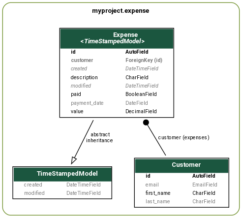

# Negros Dev

Tutorial para o site negros.dev


## Este projeto foi feito com:

* [Python 3.8.9](https://www.python.org/)
* [Django 3.1.8](https://www.djangoproject.com/)
* [Bootstrap 4.0](https://getbootstrap.com/)

## Como rodar o projeto?

* Clone esse repositório.
* Crie um virtualenv com Python 3.
* Ative o virtualenv.
* Instale as dependências.
* Rode as migrações.

```
git clone https://gitlab.com/rg3915/django-negros-dev.git
cd django-negros-dev
python3 -m venv .venv
source .venv/bin/activate
pip install -r requirements.txt
python contrib/env_gen.py
python manage.py migrate
python manage.py createsuperuser --username="admin" --email=""
```

# Tutorial

## O que é Django?

Segundo Django Brasil,

*Django é um framework web de alto nível escrito em Python que estimula o desenvolvimento rápido e limpo.*

* adota o padrão MTV
* possui ORM
* admin
* herança de templates e modelos
* open source

Documentação oficial [Django](https://www.djangoproject.com/).

## MVC x MTV

* Model - é o modelo, a camada de abstração do banco de dados, onde acontece o ORM
* View - é o controlador, onde acontece as regras de negócio e a comunicação entre a base de dados e o navegador
* Templates - é a camada de apresentação, são as páginas html


## ORM

*Object Relational Mapper* (Mapeamento Objeto Relacional)

Usa orientação a objetos para abstrair as querys do banco de dados.

O exemplo a seguir retorna todos os usuários cujo email termina com `gmail.com`.

```python
User.objects.filter(email__endswith='gmail.com')
```

No modelo a seguir `Person` será o nome da tabela no banco de dados e `first_name` será o nome do campo.


```python
# models.py
class Person(models.Model):
    first_name = models.CharField('nome', max_length=100, unique=True)
```

## O que é Virtualenv e Requirements?

**Virtualenv** é um ambiente virtual que isola seu projeto junto com suas dependências.

E **requirements** é um arquivo (`requirements.txt`) que lista todas as bibliotecas que você precisa usar no seu projeto, por exemplo:


```
# requirements.txt
Django==3.1.8
dj-database-url==0.5.0
python-decouple==3.4
django-extensions==3.1.2
```

## Qual é a essência do Django?

* ORM - abstrair as querys SQL.
* Admin - O painel de Admin facilita a nossa vida com um CRUD básico.
* Herança de templates e modelos

# Iniciando um projeto

* Instale o [Python](https://www.python.org/downloads/) na sua versão mais recente.

### Crie uma virtualenv

```
python -m venv .venv
```

### Ative a virtualenv

```
# Linux
source .venv/bin/activate
# Windows
.venv\Scripts\activate.bat
```

### Instale as dependências

```
pip install Django==3.1.8 dj-database-url python-decouple django-extensions
```

**Importante:** crie um arquivo `requirements.txt`

```
pip freeze

pip freeze | grep Django==3.1.8 >> requirements.txt
pip freeze | grep dj-database-url >> requirements.txt
pip freeze | grep python-decouple >> requirements.txt
pip freeze | grep django-extensions >> requirements.txt

cat requirements.txt
```

### Criando um .gitignore

Veja no repositório do projeto.


### Gere um arquivo .env

```
python contrib/env_gen.py

cat .env
```

### Criando um projeto

```
django-admin.py startproject myproject .
```

### Criando uma app

```
cd myproject
python ../manage.py startapp core
```

#### Edite o settings.py

```python
# settings.py
INSTALLED_APPS = [
    ...
    'django_extensions',
    'myproject.core'
]
```

### Rodando as migrações para criar um banco de dados local

```
cd ..
python manage.py migrate
```

### Criando um super usuário

```
python manage.py createsuperuser
```

### Rodando a aplicação (nível 0)

```
python manage.py runserver
```

A aplicação roda na porta 8000.


## Projeto mínimo

Veja a estrutura do projeto

```
├── .gitignore
├── contrib
│   └── env_gen.py
├── db.sqlite3
├── manage.py
├── myproject
│   ├── asgi.py
│   ├── core
│   │   ├── admin.py
│   │   ├── apps.py
│   │   ├── models.py
│   │   ├── tests.py
│   │   └── views.py
│   ├── settings.py
│   ├── urls.py
│   └── wsgi.py
├── README.md
└── requirements.txt
```

### Nível 1

### Editar settings.py

```python
# settings.py
from pathlib import Path

from decouple import Csv, config
from dj_database_url import parse as dburl

# Build paths inside the project like this: BASE_DIR / 'subdir'.
BASE_DIR = Path(__file__).resolve().parent.parent


# Quick-start development settings - unsuitable for production
# See https://docs.djangoproject.com/en/3.1/howto/deployment/checklist/

# SECURITY WARNING: keep the secret key used in production secret!
SECRET_KEY = config('SECRET_KEY')

# SECURITY WARNING: don't run with debug turned on in production!
DEBUG = config('DEBUG', default=False, cast=bool)

ALLOWED_HOSTS = config('ALLOWED_HOSTS', default=[], cast=Csv())

...

# Database
# https://docs.djangoproject.com/en/3.1/ref/settings/#databases

default_dburl = 'sqlite:///' + str(BASE_DIR / 'db.sqlite3')
DATABASES = {
    'default': config('DATABASE_URL', default=default_dburl, cast=dburl),
}

...

LANGUAGE_CODE = 'pt-br'

TIME_ZONE = 'America/Sao_Paulo'

...

STATIC_ROOT = BASE_DIR.joinpath('staticfiles')

```

### Editar urls.py

```python
# urls.py
from django.contrib import admin
from django.http import HttpResponse
from django.urls import path


def index(request):
    return HttpResponse('<h1>Django Tutorial</h1>')


urlpatterns = [
    path('', index, name='index'),
    path('admin/', admin.site.urls),
]
```


### Nível 2

### Editar core/urls.py

```
touch myproject/core/urls.py
```


```python
# core/urls.py
from django.urls import path

from .views import index

app_name = 'core'

urlpatterns = [
    path('', index, name='index'),
]
```

### Editar urls.py

```python
# urls.py
from django.contrib import admin
from django.urls import include, path

urlpatterns = [
    path('', include('myproject.core.urls', namespace='core')),
    path('admin/', admin.site.urls),
]
```


### Editar core/views.py

```
touch myproject/core/views.py
```

```python
# core/views.py
from django.http import HttpResponse


def index(request):
    return HttpResponse('<h1>Django Tutorial</h1>')
```

### Nível 3


### Editar core/views.py

```python
# core/views.py
from django.shortcuts import render


def index(request):
    template_name = 'index.html'
    return render(request, template_name)
```

### Editar core/templates/index.html

```
mkdir myproject/core/templates
touch myproject/core/templates/index.html
```

```html
<!-- index -->
<h1>Django Tutorial</h1>
<h2>Negros Dev</h2>
```


## Projeto mais completo

### Instalando e usando PostgreSQL

```
sudo apt-get install -y postgresql-12 postgresql-contrib-12
```

#### Criar database

sudo su - postgres
psql -U postgres -c "CREATE ROLE myuser ENCRYPTED PASSWORD 'mypass' LOGIN;"
psql -U postgres -c "CREATE DATABASE mydb OWNER myuser;"


### Editar o settings.py

```python
# settings.py
DATABASES = {
    'default': {
        'ENGINE': 'django.db.backends.postgresql',
        'NAME': config('POSTGRES_DB', 'postgres'),
        'USER': config('POSTGRES_USER', 'postgres'),
        'PASSWORD': config('POSTGRES_PASSWORD'),
        'HOST': config('DB_HOST', 'localhost'),
        'PORT': '5432',
    }
}
```

### Editar o .env

```
# .env
POSTGRES_DB=
POSTGRES_USER=
POSTGRES_PASSWORD=
DB_HOST=localhost
```

### Instalando psycopg2-binary

```
django.core.exceptions.ImproperlyConfigured: Error loading psycopg2 module: No module named 'psycopg2'
```

```
pip install psycopg2-binary

pip freeze | grep psycopg2-binary >> requirements.txt
```

### Criando um novo app

```
cd myproject
python ../manage.py startapp expense
```




#### Edite o settings.py

```python
# settings.py
INSTALLED_APPS = [
    ...
    'myproject.core',
    'myproject.expense',
]
```

### Editar core/models.py

```python
# core/models.py
from django.db import models


class TimeStampedModel(models.Model):
    created = models.DateTimeField(
        'criado em',
        auto_now_add=True,
        auto_now=False
    )
    modified = models.DateTimeField(
        'modificado em',
        auto_now_add=False,
        auto_now=True
    )

    class Meta:
        abstract = True
```

### Editar expense/models.py

https://docs.djangoproject.com/en/3.2/ref/models/fields/


```python
# expense/models.py
from django.db import models

from myproject.core.models import TimeStampedModel


class Customer(models.Model):
    first_name = models.CharField('nome', max_length=50)
    last_name = models.CharField('sobrenome', max_length=50, null=True, blank=True)  # noqa E501
    email = models.EmailField(null=True, blank=True)

    class Meta:
        ordering = ('first_name',)
        verbose_name = 'cliente'
        verbose_name_plural = 'clientes'

    @property
    def full_name(self):
        return f'{self.first_name} {self.last_name or ""}'.strip()

    def __str__(self):
        return self.full_name


class Expense(TimeStampedModel):
    description = models.CharField('descrição', max_length=100)
    payment_date = models.DateField('data de pagamento', null=True, blank=True)
    customer = models.ForeignKey(
        Customer,
        on_delete=models.SET_NULL,
        verbose_name='pago a',
        related_name='expenses',
        null=True,
        blank=True
    )
    value = models.DecimalField('valor', max_digits=7, decimal_places=2)
    paid = models.BooleanField('pago', default=False)

    class Meta:
        ordering = ('-payment_date',)
        verbose_name = 'despesa'
        verbose_name_plural = 'despesas'

    def __str__(self):
        return self.description

    # def get_absolute_url(self):
    #     return reverse_lazy('_detail', kwargs={'pk': self.pk})
```


### Editar expense/admin.py

```python
# expense/admin.py
from django.contrib import admin

from .models import Customer, Expense

# admin.site.register(Customer)


@admin.register(Customer)
class CustomerAdmin(admin.ModelAdmin):
    list_display = ('__str__', 'email')
    search_fields = ('first_name', 'last_name', 'email')


@admin.register(Expense)
class ExpenseAdmin(admin.ModelAdmin):
    list_display = ('__str__', 'customer', 'value', 'payment_date', 'paid')
    search_fields = ('description', 'customer__first_name', 'customer__last_name')  # noqa E501
    list_filter = ('paid',)
    date_hierarchy = 'payment_date'
```

### Atualizando o banco

Gerar arquivo de migração.

```
python manage.py makemigrations
```

Executar a migração.

```
python manage.py migrate
```


## ORM

```
python manage.py shell_plus
```

Criando alguns registros

```
customers = ['Huguinho', 'Zezinho', 'Luizinho']
for customer in customers:
    Customer.objects.create(first_name=customer)

customers = ['Prático', 'Heitor', 'Cícero']
items = []
for customer in customers:
    obj = Customer(first_name=customer)
    items.append(obj)

Customer.objects.bulk_create(items)
```

Criar despesas pelo Admin.

Alterando a data das despesas não pagas.

```
# Selecionar as despesas não pagas.
expenses = Expense.objects.filter(paid=False)

# Alterando a data de pagamento para uma data futura.
from datetime import date

future = date(2021, 5, 2)

for expense in expenses:
    expense.payment_date = future

Expense.objects.bulk_update(expenses, ['payment_date'])
```

**Cuidado ao deletar**

```
expense = Expense.objects.get(pk=1)
expense.delete()
```


## Templates

```
mkdir -p myproject/core/templates/includes

touch myproject/core/templates/base.html
touch myproject/core/templates/includes/nav.html


mkdir -p myproject/core/static/{css,img,js}

touch myproject/core/static/css/style.css
touch myproject/core/static/js/main.js

mkdir -p myproject/expense/templates/expense

touch myproject/expense/templates/expense/expense_{list,detail,form}.html
```

### Editar base.html

```html
<!-- base.html -->

<!DOCTYPE html>
<html lang="en">

<head>
  <meta charset="utf-8">
  <meta http-equiv="X-UA-Compatible" content="IE=edge">
  <meta name="viewport" content="width=device-width, initial-scale=1.0, shrink-to-fit=no">
  <link rel="shortcut icon" href="https://www.djangoproject.com/favicon.ico">
  <title>Django</title>

  <!-- Bootstrap core CSS -->
  <link rel="stylesheet" href="https://stackpath.bootstrapcdn.com/bootstrap/4.4.1/css/bootstrap.min.css">

  <!-- Font-awesome -->
  <link rel="stylesheet" href="https://maxcdn.bootstrapcdn.com/font-awesome/4.7.0/css/font-awesome.min.css">

  <link rel="stylesheet" href="">

  

</head>

<body>
  <div class="container">
    
    
  </div>

  <!-- jQuery -->
  <script src="https://code.jquery.com/jquery-3.4.1.min.js"></script>
  <!-- Bootstrap core JS -->
  <script src="https://cdn.jsdelivr.net/npm/popper.js@1.16.0/dist/umd/popper.min.js"></script>
  <script src="https://stackpath.bootstrapcdn.com/bootstrap/4.4.1/js/bootstrap.min.js"></script>
</body>

</html>
```

### Editar includes/nav.html

```html
<!-- includes/nav.html -->
<!-- https://getbootstrap.com/docs/4.0/examples/starter-template/ -->
<!-- https://github.com/JTruax/bootstrap-starter-template/blob/master/template/start.html -->
<nav class="navbar navbar-expand-md navbar-dark bg-dark fixed-top">
  <a class="navbar-brand" href="#">Navbar</a>
  <button class="navbar-toggler" type="button" data-toggle="collapse" data-target="#navbarsExampleDefault" aria-controls="navbarsExampleDefault" aria-expanded="false" aria-label="Toggle navigation">
    <span class="navbar-toggler-icon"></span>
  </button>
  <div class="collapse navbar-collapse" id="navbarsExampleDefault">
    <ul class="navbar-nav mr-auto">
      <li class="nav-item active">
        <a class="nav-link" href="#">Home <span class="sr-only">(current)</span></a>
      </li>
      <li class="nav-item">
        <a class="nav-link" href="">Despesas</a>
      </li>
    </ul>
  </div>
</nav>
```


### Editar index.html

```html
<!-- index.html -->



  <div class="jumbotron">
    <h1>Django Tutorial</h1>
    <a href="https://negros.dev/" target="_blank">negros.dev</a>
  </div>

```


### Editar style.css

```css
cat << EOF > myproject/core/static/css/style.css
body {
  margin-top: 60px;
}
EOF
```

> Rodar a aplicação

### Editar expense_list.html

```html
<!-- expense_list.html -->



  Lista de Despesas

```

### Editar expense_detail.html

```html
<!-- expense_detail.html -->



  Detalhes de Despesa

```

### Editar expense_form.html

```html
<!-- expense_form.html -->



  Adicionar Despesa

```

### Editar expense/views.py

```python
# expense/views.py
from django.shortcuts import render


def expense_list(request):
    template_name = 'expense/expense_list.html'
    return render(request, template_name)


def expense_detail(request, pk):
    template_name = 'expense/expense_detail.html'
    return render(request, template_name)


def expense_create(request):
    template_name = 'expense/expense_form.html'
    return render(request, template_name)
```


### Editar expense/urls.py

```
touch myproject/expense/urls.py
```

```python
# expense/urls.py
from django.urls import path

from myproject.expense import views as v

app_name = 'expense'

urlpatterns = [
    path('', v.expense_list, name='expense_list'),
    path('<int:pk>/', v.expense_detail, name='expense_detail'),
    path('create/', v.expense_create, name='expense_create'),
]
```

### Editar urls.py

```python
# urls.py
...
path('expense/', include('myproject.expense.urls', namespace='expense')),
...
```

### Editar includes/nav.html

```html
...
<a class="nav-link" href="">Despesas</a>
...
```

> Rodar a aplicação e navegar pelas urls.


## CRUD

### Editar expense/views.py

