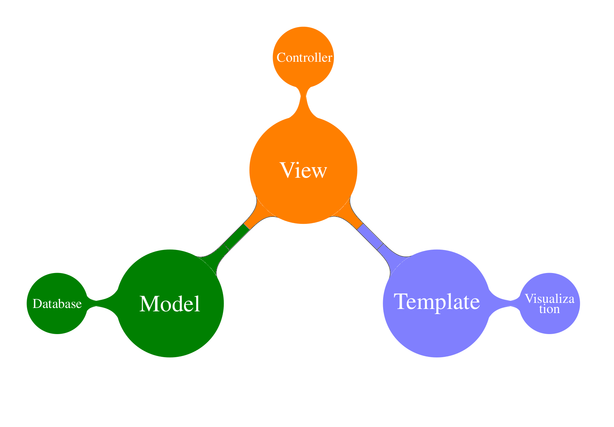
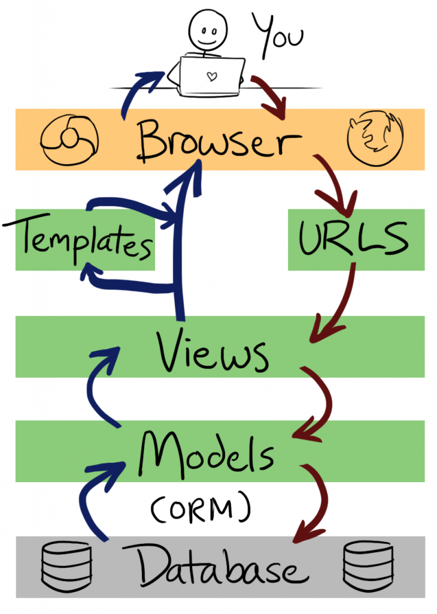

# Negros Dev

Tutorial para o site negros.dev


## Este projeto foi feito com:

* [Python 3.8.9](https://www.python.org/)
* [Django 3.1.8](https://www.djangoproject.com/)
* [Bootstrap 4.0](https://getbootstrap.com/)

## Como rodar o projeto?

* Clone esse repositório.
* Crie um virtualenv com Python 3.
* Ative o virtualenv.
* Instale as dependências.
* Rode as migrações.

```
git clone https://gitlab.com/rg3915/django-negros-dev.git
cd django-negros-dev
python3 -m venv .venv
source .venv/bin/activate
pip install -r requirements.txt
python contrib/env_gen.py
python manage.py migrate
python manage.py createsuperuser --username="admin" --email=""
```

# Tutorial

## O que é Django?

Segundo Django Brasil,

*Django é um framework web de alto nível escrito em Python que estimula o desenvolvimento rápido e limpo.*

* adota o padrão MTV
* possui ORM
* admin
* herança de templates e modelos
* open source

Documentação oficial [Django](https://www.djangoproject.com/).

## MVC x MTV

* Model - é o modelo, a camada de abstração do banco de dados, onde acontece o ORM
* View - é o controlador, onde acontece as regras de negócio e a comunicação entre a base de dados e o navegador
* Templates - é a camada de apresentação, são as páginas html






## ORM

*Object Relational Mapper* (Mapeamento Objeto Relacional)

Usa orientação a objetos para abstrair as querys do banco de dados.

O exemplo a seguir retorna todos os usuários cujo email termina com `gmail.com`.

```python
User.objects.filter(email__endswith='gmail.com')
```

No modelo a seguir `Person` será o nome da tabela no banco de dados e `first_name` será o nome do campo.


```python
# models.py
class Person(models.Model):
    first_name = models.CharField('nome', max_length=100, unique=True)
```

## O que é Virtualenv e Requirements?

**Virtualenv** é um ambiente virtual que isola seu projeto junto com suas dependências.

E **requirements** é um arquivo (`requirements.txt`) que lista todas as bibliotecas que você precisa usar no seu projeto, por exemplo:


```
# requirements.txt
Django==3.1.8
dj-database-url==0.5.0
python-decouple==3.4
django-extensions==3.1.2
```

## Qual é a essência do Django?

* ORM - abstrair as querys SQL.
* Admin - O painel de Admin facilita a nossa vida com um CRUD básico.
* Herança de templates e modelos

# Iniciando um projeto

* Instale o [Python](https://www.python.org/downloads/) na sua versão mais recente.

### Crie uma virtualenv

```
python -m venv .venv
```

### Ative a virtualenv

```
# Linux
source .venv/bin/activate
# Windows
.venv\Scripts\activate.bat
```

### Instale as dependências

```
pip install Django==3.1.8 dj-database-url python-decouple django-extensions
```

**Importante:** crie um arquivo `requirements.txt`

```
pip freeze

pip freeze | grep Django==3.1.8 >> requirements.txt
pip freeze | grep dj-database-url >> requirements.txt
pip freeze | grep python-decouple >> requirements.txt
pip freeze | grep django-extensions >> requirements.txt

cat requirements.txt
```

### Criando um .gitignore

Veja no repositório do projeto.


### Gere um arquivo .env

```
python contrib/env_gen.py

cat .env
```

### Criando um projeto

```
django-admin.py startproject myproject .
```

### Criando uma app

```
cd myproject
python ../manage.py startapp core
```

#### Edite o settings.py

```python
# settings.py
INSTALLED_APPS = [
    ...
    'django_extensions',
    'myproject.core'
]
```

### Rodando as migrações para criar um banco de dados local

```
cd ..
python manage.py migrate
```

### Criando um super usuário

```
python manage.py createsuperuser
```

### Rodando a aplicação (nível 0)

```
python manage.py runserver
```

A aplicação roda na porta 8000.


## Projeto mínimo

Veja a estrutura do projeto

```
├── .gitignore
├── contrib
│   └── env_gen.py
├── db.sqlite3
├── manage.py
├── myproject
│   ├── asgi.py
│   ├── core
│   │   ├── admin.py
│   │   ├── apps.py
│   │   ├── models.py
│   │   ├── tests.py
│   │   └── views.py
│   ├── settings.py
│   ├── urls.py
│   └── wsgi.py
├── README.md
└── requirements.txt
```

### Nível 1

### Editar settings.py

```python
# settings.py
from pathlib import Path
from decouple import Csv, config
from dj_database_url import parse as dburl

# Build paths inside the project like this: BASE_DIR / 'subdir'.
BASE_DIR = Path(__file__).resolve().parent.parent


# Quick-start development settings - unsuitable for production
# See https://docs.djangoproject.com/en/3.1/howto/deployment/checklist/

# SECURITY WARNING: keep the secret key used in production secret!
SECRET_KEY = config('SECRET_KEY')

# SECURITY WARNING: don't run with debug turned on in production!
DEBUG = config('DEBUG', default=False, cast=bool)

ALLOWED_HOSTS = config('ALLOWED_HOSTS', default=[], cast=Csv())

...

# Database
# https://docs.djangoproject.com/en/3.1/ref/settings/#databases

default_dburl = 'sqlite:///' + str(BASE_DIR / 'db.sqlite3')
DATABASES = {
    'default': config('DATABASE_URL', default=default_dburl, cast=dburl),
}

...

LANGUAGE_CODE = 'pt-br'

TIME_ZONE = 'America/Sao_Paulo'

...

STATIC_ROOT = BASE_DIR.joinpath('staticfiles')

```

### Editar urls.py


### Nível 2

### Editar core/urls.py


### Editar core/views.py


### Nível 3

### Editar core/urls.py


### Editar core/views.py


### Editar core/templates/index.html


## Projeto mais completo

### Instalando e usando PostgreSQL

